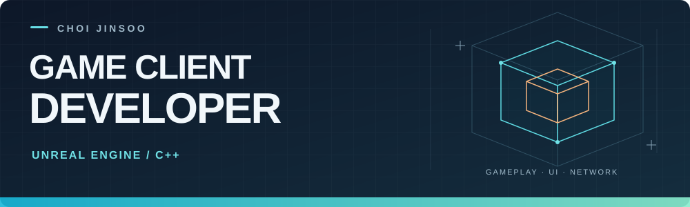

  

  <a href="https://garrulous-maxilla-66f.notion.site/Choi-Jinsoo-12c9bbc7078b8000b58ac32e6824fb5c"><b>Portfolio</b></a>&nbsp;&nbsp; · &nbsp;&nbsp;
  <a href="https://github.com/chickenbuger/Rogue10m/tree/main/DevLog"><b>Dev Log</b></a>&nbsp;&nbsp; · &nbsp;&nbsp;
  <a href="https://jscodestudyblog.tistory.com/"><b>Blog</b></a>&nbsp;&nbsp; · &nbsp;&nbsp;
  <a href="mailto:gksdidxornjs@gmail.com"><b>Contact</b></a>

## 안녕하세요, 게임 클라이언트 개발자 최진수입니다

**Unreal Engine과 C++로 전투, 인벤토리, UI, 멀티플레이 동기화를 구현합니다.**
MMORPG 클라이언트를 담당하며 서버 패킷을 해석하고 플레이어의 입력과 화면 피드백을 연결했습니다.
현재는 **Rogue10m**에서 데이터 기반 전투와 UI 구조를 다듬고 있습니다.

| 집중하는 영역 | 구현 경험 |
| :--- | :--- |
| **Gameplay** | Data Asset 기반 공격·콤보, GAS 능력치, 몬스터 AI |
| **UI & Inventory** | UMG·Slate, NxM 인벤토리, 드래그 앤 드롭, HUD 갱신과 위젯 풀링 |
| **Multiplayer** | 이동·스킬·애니메이션 동기화, RPC·Replication, Listen Server·Steam 세션 |
| **C++ & Graphics** | MFC·GDI, 충돌·물리 시뮬레이션, OpenGL·Direct3D 11 학습 |

## Selected Projects

### 01. Rogue10m

**Unreal Engine 5 · C++ · GAS · UMG** &nbsp; / &nbsp; 개인 프로젝트, 개발 중

허브에서 준비하고 전투와 성장을 거쳐, **20분 안에 보스를 공략하는 로그라이크 액션**입니다.

- **공격 데이터 설계:** 공격 형태와 히트 모드를 분리하고, 플레이어와 몬스터가 공통 Data Asset을 사용하도록 구성했습니다.
- **NxM 인벤토리:** 10×10 그리드의 공간 점유, 드래그 앤 드롭, 경계·아이템 충돌 프리뷰를 구현했습니다.
- **UI 갱신 개선:** 값이 같으면 HUD 갱신을 생략하고, 데미지 위젯 풀링과 슬롯·로그의 증분 갱신을 적용했습니다.

[Repository](https://github.com/chickenbuger/Rogue10m) · [공격 데이터 설계](https://github.com/chickenbuger/Rogue10m/blob/main/Docs/AttackSkillDataAssetGuide.md) · [인벤토리 구조](https://github.com/chickenbuger/Rogue10m/blob/main/Docs/GridInventoryAndMenuWindowsGuide.md)

### 02. UE4 MMORPG

**Unreal Engine 4.27 · C++ · MySQL** &nbsp; / &nbsp; 2인 팀, 클라이언트 담당 · 2023

서버 개발자와 협업해 RPG 클라이언트의 **동기화, 전투, UI 시스템**을 구현했습니다.

- **동기화와 디버깅:** 위치·스킬 데이터를 시각화해 패킷 설계 오류를 찾고, 서버와 함께 수정했습니다.
- **RPG 시스템:** 인벤토리, 장비, 파티, 버프, 미니맵, HUD와 몬스터 AI를 담당했습니다.
- **애니메이션 응답:** 로컬 애니메이션을 먼저 실행하고 서버 응답과 경과 시간을 반영하는 흐름을 구성했습니다.

[팀 Repository](https://github.com/Apeirogon99/Project_LD) · [시연 영상](https://www.youtube.com/watch?v=TaOd_ceWnW4&t=6s) · [프로젝트 상세](https://app.notion.com/p/38e9bbc7078b81cba65ef8bdad1850da)

### 03. Peglin MFC

**C++20 · MFC · GDI · XAudio2 · XInput** &nbsp; / &nbsp; 개인 프로젝트, Version 10.2 1차 마감

Peglin 스타일의 게임을 만들며 **물리·전투부터 저장·입력·오디오까지** 기능을 확장했습니다.

- **플레이 시스템:** 분기형 런, 페그·오브·유물 전투, 상점과 보스, 저장·이어하기를 구현했습니다.
- **제작 도구:** 콘텐츠 미리보기와 핫 리로드에 검증을 붙이고, 실패 시 기존 게임 상태를 유지하도록 구성했습니다.
- **반복 검증:** Version 10.2 기록 기준, 1,251개 테스트를 Debug·Release의 x64·x86에서 실행해 **총 5,004회 통과**했습니다.

[Repository](https://github.com/chickenbuger/Peglin_MFC_Copy) · [개발 기록](https://github.com/chickenbuger/Peglin_MFC_Copy/tree/main/DEV_LOG) · [마감 범위와 검증 결과](https://github.com/chickenbuger/Peglin_MFC_Copy/blob/main/DEV_LOG/Version_10.2.md)

### 04. CountQuest

**Defold · Lua · HTML5** &nbsp; / &nbsp; 개인 참가작 · OpenAI Game Builders Seoul 2026

장면을 관찰한 뒤 두 대상 중 더 많았던 쪽을 맞히는 **관찰·기억 게임**입니다.
5개 테마·50개 스테이지를 데이터로 구성하고, 콘텐츠 검증과 자산 동기화, Bob 빌드를 거쳐 Cloudflare Pages로 배포했습니다.

[브라우저에서 플레이](https://countquest-competition-pages-temp.pages.dev/)

## Tech Stack

  
  
  
  
  

주력은 <strong>Unreal Engine / C++</strong>입니다. Unity / C#으로 모바일 게임과 게임잼 프로젝트를,
Defold / Lua로 브라우저 게임을 제작했습니다. Git·GitHub·Visual Studio를 사용하고,
Codex와 Unreal Engine MCP를 구현·디버깅·테스트에 활용합니다.

<b>다른 프로젝트와 학습 기록</b>

| 프로젝트 | 기술과 작업 내용 |
| :--- | :--- |
| [Last Man Standing](https://app.notion.com/p/38e9bbc7078b8194ac2fda8bf1227cfd) | UE5, RPC·Replication, Listen Server와 Steam 세션 |
| Boss Raid / GAS | UE5, Behavior Tree 보스 AI, 전투 Montage, 장비·HUD |
| 강남스퀘어 | UE4, ProudNet 동기화, 채팅·인벤토리, Android 배포 |
| SODA / Jelly Tetris | Unity, 센서 입력·진동, Grid 판정과 소프트 바디 |
| [OpenGL A*](https://github.com/chickenbuger/OpenGL-A-) | 경로 탐색과 장애물 배치 시각화 |
| [Vector Field](https://github.com/chickenbuger/VectorField) | 벡터장·중력장 시각화 |
| [Position Based Dynamics](https://github.com/chickenbuger/PositionBasedDynamic) | 위치 기반 물리 시뮬레이션 학습 |
| [DirectX 기초](https://github.com/chickenbuger/Project_DXF) | 렌더링 환경 구성과 D3DClass 구조화 |

## 개발과 검증

차량 SW QA 업무에서 기능·시나리오 테스트와 펌웨어 업데이트 후 동작 검증을 수행하고 있습니다.
AI를 활용해 영상 녹화·로그 추출용 **ADB Tool**을 제작하고 실제 증적 수집에 사용했습니다.
게임 개발에서도 구현 후 빌드와 테스트를 반복하고, 문제의 원인과 변경 이유를 개발 기록으로 남깁니다.

<b>학력과 활동</b>

- 강남대학교 소프트웨어응용학부 졸업 · 가상현실 전공, 소프트웨어 부전공 (2018–2024)
- 정보처리기사 · SQLD
- CAVE 가상현실 학술 동아리 임원, 교내 전시·학술제 4회 참여
- Global Game Jam × Zempie (2024·2025), 만들래 10분 게임 콘테스트 (2025), OpenAI Game Builders Seoul (2026) 참가

---

**Contact** &nbsp; [gksdidxornjs@gmail.com](mailto:gksdidxornjs@gmail.com) &nbsp; · &nbsp; [Notion Portfolio](https://garrulous-maxilla-66f.notion.site/Choi-Jinsoo-12c9bbc7078b8000b58ac32e6824fb5c)
